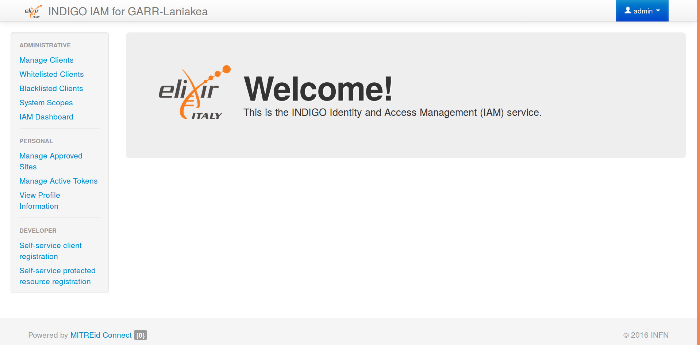
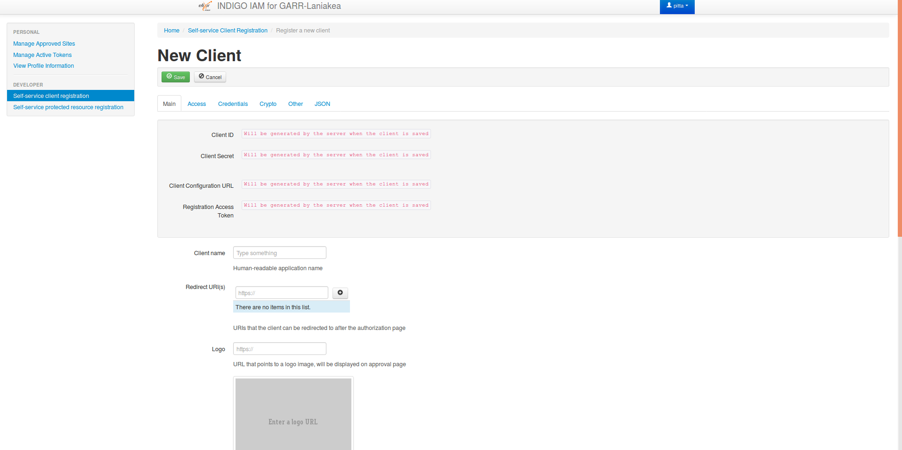

Identity Access Manager (IAM) installation and configuration
============================================================

Enable Google Authentication
----------------------------

1. Access to `Google developers console <https://console.developers.google.com/apis/credentials>`_ and create and configure a new credential project.

   1.2 Create Credentials > OAuth Client ID

   1.3 Application Type: Web Application

   1.4 Name: Service Provider (SP) name

   1.5 Authorized JavaScript origins: https://<IAM_VM_HOSTNAME>.

   1.6 Authorized redirect URIs: https://<IAM_VM_HOSTNAME>/openid_connect_login

   1.7 Copy client ID and client secret

Setting up IAM role
-------------------

1. Create and edit iam.yaml in **group_vars** that contain all the following variables:

.. highlight:: none

::

 iam_fqdn: <IAM-VM-HOSTNAME>
 iam_mysql_root_password: *******
 iam_organization_name: '****'
 iam_logo_url: <logo-url>
 iam_enable_google_auth: true
 iam_account_linking_disable: true
 iam_mysql_image: "mysql:5.5"
 iam_image: indigoiam/iam-login-service:v1.4.0-latest
 iam_notification_disable: true
 iam_notification_from: 'iam@{{iam_fqdn}}'
 iam_google_client_id: '<google_client_ID>'
 iam_google_client_secret: '<google_client_secret>'

  
.. highlight:: default

Run the role
------------
Run the role using *ansible-playbook* with input ``indigopass-deploy/indigopaas-deploy/ansible/playbooks/deploy-iam.yml``

**deploy-iam.yml**

.. code:: yaml

   ---
   - name: Deploy IAM service
     hosts: iam
     become: yes
     gather_facts: false
     pre_tasks:
       - name: Check python is installed
         raw:  test -e /usr/bin/python || (apt -y update && apt install -y python-minimal)
         changed_when: false
       - name: Gathering Facts
         setup:
     roles:
       - iam

command

.. code:: bash
   
   ~$ sudo ansible-playbook -i <inventory-path> --private-key <private_key-path> deploy-iam.yml

.. figure:: _static/iam_login.png
   :scale: 50%
   :align: center

.. centered:: Fig.2: IAM login page

IAM test
--------

Test 1: login as admin 
^^^^^^^^^^^^^^^^^^^^^^

1. Login as admin *username: admin password: password*
2. Change default password

Test 2: register a new user
^^^^^^^^^^^^^^^^^^^^^^^^^^^

1. Click Register a new account
2. Compile the form
3. Login as admin and accept the request
4. login as new user

Test 3: register using Google account (optional)
^^^^^^^^^^^^^^^^^^^^^^^^^^^^^^^^^^^^^^^^^^^^^^^^

1. Sign-in with Google 
2. Login as admin and accept the request
3. Login with Google

Create IAM Client
-----------------
1. Login as non-Admin user
2. Click on *MitreID Dashboard* and then *Self-service client registration*
3. Click on *New client* and compile the form wit the following paramethers

| *Client name* = iam-garr-client

| *redirect URI* = https://<IAM hostname>

| *scope:*

* openid
* profile
* email
* address
* phone
* offline_access

| *Grant Types*

* authorization code
* refresh

| *Response types*

* code

| *credentials*

* client Secret over HTTP Post

| *Public key set*

* By URI

4. save the client ID and client secret

5. from Manage Clients Re-edit the client and set also in grant types:

* password

.. centered:: Fig.3: MitreID Dashboard screenshot

 

.. centered:: Fig.3: MitreID Dashboard client registration

