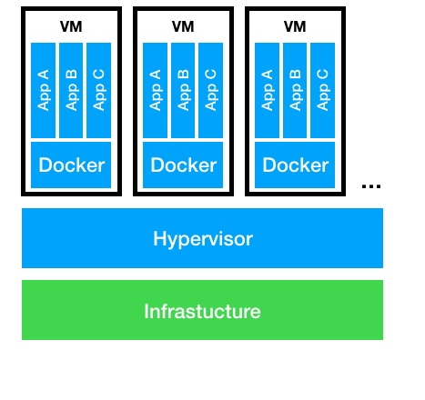

Virtual Machines deployment 
===========================

Laniakea (Tangaro et al., n.d.) is a software suite, based on the INDIGO-DataCloud middleware that allows the provision of a “Galaxy on-demand” Platform as a Service
(PaaS) over public or private e-infrastructures.

The INDIGO-DataCloud softwares that constitute Laniakea service, are dockerized and each one run on a specific VM (Fig.1). 
Exploiting both VMs and Docker container create an additional level of virtualization. This approach allows to have the characteristics of isolation of the Docker container with the security of the VM.

.. centered:: Fig.1: PaaS component architecture scheme

On the Openstack tenant the virtual machines that will contain the Laniakea INDIGO-DataCloud services has to be created (table.1).

|

Default caracteristic:

* SO = Ubuntu 16.04
* Open ports = 22,80  

.. centered:: List of the necessary virtual machines, completed with minimumun requirements, needed for the installation of Laniakea service

.. csv-table::
   :header: "Service", "RAM", "vCPU", "Storage", "open ports", "net"
   :widths: auto
   :file: ./table_VMS.csv

.. note:: The vm_master, as well as hosting the proxy server, will be utilized as control virtual machine from this vm all the services will be installed using `Ansible <https://www.ansible.com/>`_

